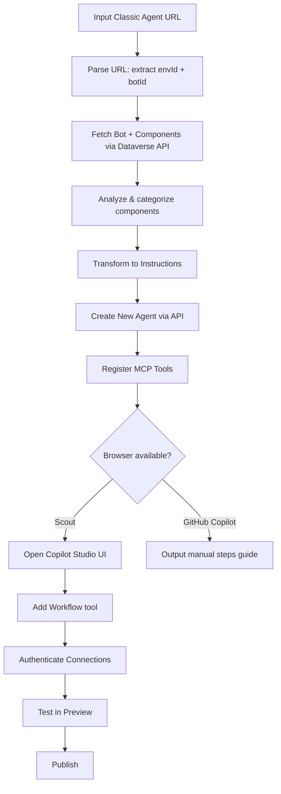

# Copilot Studio Migration Skill

A GitHub Copilot / Microsoft Scout skill that migrates **Classic** Copilot Studio agents (topics-based) to the **New Experience** (instructions-based).

## Overview

In June 2026, Microsoft Copilot Studio introduced a new agent experience that replaces topic-based conversation design with natural language instructions, tools, and skills. However, there is no official migration path from Classic to New.

This skill automates the migration: just provide a Classic agent URL, and it creates a New Experience agent automatically.

## Features

| Feature | GitHub Copilot | Microsoft Scout |
|---------|:-:|:-:|
| Classic agent configuration analysis | ✅ | ✅ |
| Automatic Instructions conversion | ✅ | ✅ |
| New agent creation | ✅ | ✅ |
| MCP Tools registration | ✅ | ✅ |
| Workflow (Power Automate) addition | ❌ Manual guide | ✅ Browser automation |
| Connection authentication | ❌ Manual guide | ✅ Browser automation |
| Test execution | ❌ | ✅ Auto-test in Preview |
| Publish | ❌ Manual guide | ✅ Auto after user approval |

## Classic → New Conversion Rules

| Classic Element | New Experience Equivalent |
|---|---|
| Topics (triggers + nodes) | Instructions (natural language) |
| Adaptive Card forms | Conversational collection (LLM asks questions) |
| Adaptive Card buttons (messageBack) | Text-based triggers |
| Knowledge Source (Dataverse) | Dataverse MCP Tool |
| MCP Server actions | McpTool component |
| Power Automate flows | Workflow Tool (added via UI) |
| Connector actions | Tool (added via UI) |
| System Topics | Not needed (orchestrator handles automatically) |

## Prerequisites

- **Azure CLI** (`az`) installed and logged into the target environment's tenant
- **PowerShell 7** (`pwsh`) installed
- **Maker permissions** in the target Dataverse environment
- (Scout only) Signed into Copilot Studio in the browser

## Installation

### GitHub Copilot (VS Code)

Clone into your skills directory:

```bash
git clone https://github.com/echooou/copilot-studio-migration-skill.git ~/.copilot/skills/copilot-studio-migration
```

Or manually place the folder:
```
~/.copilot/skills/copilot-studio-migration/
├── SKILL.md
└── migrate.ps1
```

### Microsoft Scout

**Option A — Import via URL:**
1. Open Scout Settings → **Import Skill**
2. Paste the raw SKILL.md URL:
   ```
   https://raw.githubusercontent.com/echooou/copilot-studio-migration-skill/main/SKILL.md
   ```
3. Click **Import**

**Option B — Import via folder:**
1. Clone or download this repository
2. Open Scout Settings → **Import Skill**
3. Select "Drop a skill folder here" and choose the cloned folder

## Usage

In GitHub Copilot or Scout chat:

```
Migrate this classic agent to new experience:
https://copilotstudio.preview.microsoft.com/environments/{envId}/bots/{botId}
```

### First-time Setup

Find the Dataverse org URL for your environment:
```powershell
pac env list | Select-String "{envId}"
```

Log in to Azure CLI with the correct tenant:
```powershell
az login --tenant {tenantId}
```

## Execution Flow



## File Structure

| File | Description |
|------|-------------|
| `SKILL.md` | Skill definition file (triggers, execution steps, conversion rules) |
| `migrate.ps1` | PowerShell migration script (Phase 1: API-based migration) |
| `README.md` | Documentation (Japanese) |
| `README.en.md` | Documentation (English) — this file |

## How It Works

### Phase 1: API-Based Migration (automated)

1. **Parse** the Classic agent URL to extract environment ID and bot ID
2. **Authenticate** via Azure CLI (`az account get-access-token`)
3. **Extract** all bot components from Dataverse (topics, actions, knowledge sources)
4. **Analyze** components by kind:
   - `AdaptiveDialog` → Topics (system vs custom)
   - `TaskDialog` with MCP → MCP Tools
   - `TaskDialog` with Flow → Power Automate actions
   - `GptComponentMetadata` → Instructions source
   - `KnowledgeSourceConfiguration` → Knowledge sources
5. **Transform** instructions:
   - Keep existing GPT config instructions as base
   - Resolve topic name references (`{System.Bot.Components.Topics...}`)
   - Convert Adaptive Card input forms to conversational prompts
   - Add escalation/workflow guidance
6. **Create** new agent with `cliagent-1.0.0` template and `CLICopilotRecognizer`
7. **Register** MCP tools as `McpTool` botcomponents

### Phase 2: Browser Automation (Scout only)

8. **Navigate** to the new agent in Copilot Studio
9. **Add** Workflow tools via "Add a tool" → "Workflow" UI
10. **Authenticate** connections (OAuth sign-in flow)
11. **Test** in the Preview tab
12. **Publish** (after user approval)

### Phase 3: Fallback (GitHub Copilot)

If no browser is available, outputs clear manual steps with URLs and flow IDs.

## Limitations

- **Connection authentication** requires OAuth browser flow — cannot be fully automated without Scout
- **Workflow Tool format** is not publicly documented for the New Experience — must be added via UI
- **Microsoft 365 Copilot channel** may not be available in the New Experience yet
- **PAC CLI bug**: `pac copilot extract-template` crashes with newer knowledge source types (this skill uses direct API calls to work around it)

## Troubleshooting

| Error | Cause | Solution |
|-------|-------|----------|
| `az account get-access-token` fails | Not logged in or wrong tenant | `az login --tenant {tenantId}` |
| Bot creation returns 403 | Insufficient permissions | Verify Maker role in the environment |
| Component creation returns 400 | Schema name issue | Ensure ASCII-only, max 100 characters |
| Script encoding errors | Using Windows PowerShell 5.1 | Use `pwsh` (PowerShell 7) instead |
| "Add a tool" button not found (Scout) | Page still loading | Wait and retry |

## License

MIT
