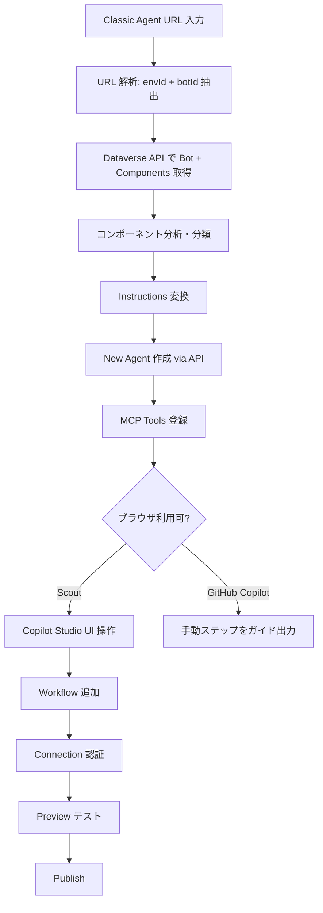

# Copilot Studio Migration Skill

> **English version**: [README.en.md](README.en.md)

Microsoft Copilot Studio の **Classic エージェント**（トピックベース）を **New Experience エージェント**（Instructions ベース）に移行する GitHub Copilot / Microsoft Scout 用スキルです。

## 概要

2026年6月にリリースされた Copilot Studio の新しいエージェント体験（New Experience）は、トピックベースの会話設計から、自然言語 Instructions + Tools/Skills による設計に移行しています。しかし、公式には Classic → New の移行パスは提供されていません。

このスキルは、Classic エージェントの URL を入力するだけで、New Experience エージェントを自動作成します。

## 機能

| 機能 | GitHub Copilot | Microsoft Scout |
|------|:-:|:-:|
| Classic エージェントの構成解析 | ✅ | ✅ |
| Instructions 自動変換 | ✅ | ✅ |
| New エージェント作成 | ✅ | ✅ |
| MCP Tools 登録 | ✅ | ✅ |
| Workflow (Power Automate) 追加 | ❌ 手動ガイド | ✅ ブラウザ自動操作 |
| Connection 認証 | ❌ 手動ガイド | ✅ ブラウザ自動操作 |
| テスト実行 | ❌ | ✅ Preview タブで自動テスト |
| Publish | ❌ 手動ガイド | ✅ ユーザー承認後に自動実行 |

## Classic → New 変換ルール

| Classic の要素 | New での対応 |
|---|---|
| Topics (トリガー + ノード) | Instructions（自然言語記述） |
| Adaptive Card フォーム | 対話型ヒアリング（LLMが質問） |
| Adaptive Card ボタン (messageBack) | テキストトリガー |
| Knowledge Source (Dataverse) | Dataverse MCP Tool |
| MCP Server アクション | McpTool コンポーネント |
| Power Automate フロー | Workflow Tool（UI で追加） |
| Connector アクション | Tool（UI で追加） |
| System Topics | 不要（オーケストレーターが処理） |

## 前提条件

- **Azure CLI** (`az`) がインストール済みで、対象環境のテナントにログイン済み
- **PowerShell 7** (`pwsh`) がインストール済み
- 対象 Dataverse 環境の **Maker 権限**
- (Scout の場合) Copilot Studio にブラウザでサインイン済み

## インストール

### GitHub Copilot (VS Code)

フォルダごと `~/.copilot/skills/` に配置：

```
~/.copilot/skills/copilot-studio-migration/
├── SKILL.md
└── migrate.ps1
```

### Microsoft Scout

1. Scout の設定 → **Import Skill**
2. 「Drop a skill folder here」でこのリポジトリのフォルダを選択
3. または SKILL.md の raw URL を貼り付け:
   ```
   https://raw.githubusercontent.com/{owner}/copilot-studio-migration-skill/main/SKILL.md
   ```

## 使い方

### GitHub Copilot / Scout 共通

チャットで以下のように依頼：

```
この classic agent を new experience に移行して:
https://copilotstudio.preview.microsoft.com/environments/{envId}/bots/{botId}
```

### 初回実行時の準備

対象環境の Dataverse URL を確認：
```powershell
pac env list | Select-String "{envId}"
```

Azure CLI で対象テナントにログイン：
```powershell
az login --tenant {tenantId}
```

## 実行フロー



## ファイル構成

| ファイル | 説明 |
|----------|------|
| `SKILL.md` | スキル定義ファイル（トリガー条件、実行手順、変換ルール） |
| `migrate.ps1` | PowerShell 移行スクリプト（Phase 1: API ベース移行を実行） |
| `README.md` | このファイル |

## 制限事項

- **Connection 認証**: OAuth フローが必要なため、Scout 以外では手動操作が必須
- **Workflow Tool**: New Experience での Workflow コンポーネント形式が未公開のため、UI 経由で追加が必要
- **Microsoft 365 Copilot チャネル**: New Experience では未サポートの可能性あり
- **PAC CLI バグ**: `pac copilot extract-template` は新しい Knowledge Source タイプで crashする既知の問題あり（本スキルは直接 API を使用して回避）

## トラブルシューティング

| エラー | 原因 | 対処 |
|--------|------|------|
| `az account get-access-token` 失敗 | 未ログイン or テナント違い | `az login --tenant {tenantId}` |
| Bot 作成で 403 | Maker 権限不足 | 環境の Maker ロールを確認 |
| Component 作成で 400 | schemaname 問題 | ASCII 文字のみ、100文字以内 |
| Script encoding error | Windows PowerShell (5.1) | `pwsh` (PowerShell 7) を使用 |

## ライセンス

MIT
