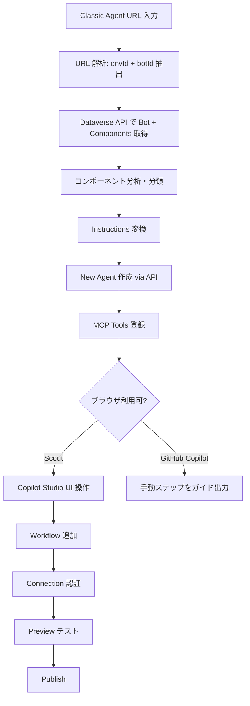

# Copilot Studio Migration Skill

> **English version**: [README.en.md](README.en.md)

Microsoft Copilot Studio の **Classic エージェント**（トピックベース）を **New Experience エージェント**（Instructions ベース）に移行する GitHub Copilot / Microsoft Scout 用スキルです。

## 概要

2026年6月にリリースされた Copilot Studio の新しいエージェント体験（New Experience）は、トピックベースの会話設計から、自然言語 Instructions + Tools/Skills による設計に移行しています。しかし、公式には Classic → New の移行パスは提供されていません。

このスキルは、Classic エージェントの URL を入力するだけで、New Experience エージェントを自動作成します。

## 機能

| 機能 | GitHub Copilot | Microsoft Scout |
|------|:-:|:-:|
| Classic エージェントの構成解析 | ✅ | ✅ |
| Instructions 自動変換 | ✅ | ✅ |
| New エージェント作成 | ✅ | ✅ |
| MCP Tools 登録 | ✅ | ✅ |
| Workflow (Power Automate) 追加 | ❌ 手動ガイド | ✅ ブラウザ自動操作 |
| Connection 認証 | ❌ 手動ガイド | ✅ ブラウザ自動操作 |
| テスト実行 | ❌ | ✅ Preview タブで自動テスト |
| Publish | ❌ 手動ガイド | ✅ ユーザー承認後に自動実行 |

## Classic → New 変換ルール

| Classic の要素 | New での対応 |
|---|---|
| Topics (トリガー + ノード) | Instructions（自然言語記述） |
| Adaptive Card フォーム | 対話型ヒアリング（LLMが質問） |
| Adaptive Card ボタン (messageBack) | テキストトリガー |
| Knowledge Source (Dataverse) | Dataverse MCP Tool |
| MCP Server アクション | McpTool コンポーネント |
| Power Automate フロー | Workflow Tool（UI で追加） |
| Connector アクション | Tool（UI で追加） |
| System Topics | 不要（オーケストレーターが処理） |

## 前提条件

- **Azure CLI** (`az`) がインストール済みで、対象環境のテナントにログイン済み
- **PowerShell 7** (`pwsh`) がインストール済み
- 対象 Dataverse 環境の **Maker 権限**
- (Scout の場合) Copilot Studio にブラウザでサインイン済み

## インストール

### GitHub Copilot (VS Code)

フォルダごと `~/.copilot/skills/` に配置：

```
~/.copilot/skills/copilot-studio-migration/
├── SKILL.md
└── migrate.ps1
```

### Microsoft Scout

1. Scout の設定 → **Import Skill**
2. 「Drop a skill folder here」でこのリポジトリのフォルダを選択
3. または SKILL.md の raw URL を貼り付け:
   ```
   https://raw.githubusercontent.com/{owner}/copilot-studio-migration-skill/main/SKILL.md
   ```

## 使い方

### GitHub Copilot / Scout 共通

チャットで以下のように依頼：

```
この classic agent を new experience に移行して:
https://copilotstudio.preview.microsoft.com/environments/{envId}/bots/{botId}
```

### 初回実行時の準備

対象環境の Dataverse URL を確認：
```powershell
pac env list | Select-String "{envId}"
```

Azure CLI で対象テナントにログイン：
```powershell
az login --tenant {tenantId}
```

## 実行フロー



## ファイル構成

| ファイル | 説明 |
|----------|------|
| `SKILL.md` | スキル定義ファイル（トリガー条件、実行手順、変換ルール） |
| `migrate.ps1` | PowerShell 移行スクリプト（Phase 1: API ベース移行を実行） |
| `README.md` | このファイル |

## コンポーネント対応状況（全網羅）

Copilot Studio Classic の全コンポーネント/機能に対する移行対応状況です。

### ✅ 自動移行対応

| コンポーネント | 移行方法 |
|---|---|
| Instructions / GPT Config | `agentSettings.instructions` に変換 |
| Custom Topics（トリガー + ノード） | Instructions 内に自然言語で記述 |
| System Topics（Greeting, Fallback 等） | 不要（New のオーケストレーターが自動処理） |
| MCP Server アクション | `McpTool` コンポーネントとして登録 |
| Knowledge Source（Dataverse テーブル） | Dataverse MCP Tool で代替 |
| Conversation Starters | Instructions に含める |
| Model 選択 | `agentSettings.model.series` に設定 |
| エスカレーション設定 | Instructions 内にフロー記述 |

### ⚠️ 一部対応（変換あり・情報ロスの可能性）

| コンポーネント | 移行方法 | 注意点 |
|---|---|---|
| Adaptive Card（入力フォーム） | 対話型ヒアリングに変換 | カードのビジュアル/UXは失われる |
| Adaptive Card（ボタン/messageBack） | テキストトリガーに変換 | ワンタップ操作が文字入力に変わる |
| Power Automate フロー | Workflow Tool（Scout: 自動 / GH Copilot: 手動） | Flow 自体は既存のまま再利用 |
| Connector アクション | Tool として追加（Scout: 自動 / GH Copilot: 手動） | Connection 再設定が必要 |
| Knowledge Source（SharePoint） | Dataverse MCP では代替不可、手動追加が必要 | New Experience の Knowledge UI で追加 |
| Knowledge Source（URL/ファイル） | 手動追加が必要 | New Experience の Knowledge UI で追加 |
| 認証設定 (Authentication) | 基本設定はコピー、詳細は手動確認 | OAuth 設定の再検証が必要 |
| チャネル設定 | Teams のみ自動設定 | Web/M365 Copilot 等は手動追加 |

### ❌ 未対応（手動対応または New Experience で非対応）

| コンポーネント | 理由 | 対応方法 |
|---|---|---|
| **Computer Use (CUA)** | New Experience 固有の機能。Classic には存在しない | 移行対象外（New で新規設定） |
| **AI Builder プロンプト** | Classic のプロンプトノードは New の Instructions/Tool で代替設計が必要 | 手動で Skill または Tool として再実装 |
| **Code Interpreter** | Classic の設定は移行不可。New では Model 機能として組み込み | New Agent 作成後に UI で有効化 |
| **エンティティ（カスタム/プリビルト）** | New Experience では LLM が自動抽出するため不要 | Instructions に抽出ルールを記述 |
| **変数（Topic/Global/System）** | New Experience にはトピック変数の概念がない | Tool の入出力パラメータで代替 |
| **多言語サポート** | Classic の言語バリエーションは個別移行不可 | New Agent を各言語で作成、または Instructions に多言語対応を記述 |
| **音声設定 (Voice)** | Voice チャネルの設定は API 移行対象外 | New Experience の Voice 設定で再構成 |
| **Agent-to-Agent (A2A)** | Connected Agent の設定は移行不可 | New Experience の Connected Agents UI で再設定 |
| **Component Collections** | エクスポート/インポート用のパッケージ機能 | 移行対象外 |
| **Analytics / カスタムメトリクス** | Classic の分析設定は New に引き継がれない | New Experience の Monitor タブで自動提供 |
| **Content Moderation 設定** | Classic の Low/Medium/High 設定 | New Experience で再設定（デフォルトで適用） |
| **Microsoft 365 Copilot チャネル** | New Experience でのサポート状況が未確定 | 確認後に手動追加 |
| **Bing Custom Search (Knowledge)** | 専用 Knowledge Source タイプ | New Experience の Knowledge UI で手動追加 |
| **テーブル権限 / セキュリティロール** | Dataverse レベルの設定で Agent 外 | 別途管理 |

### 移行時の設計判断が必要なもの

| Classic の機能 | New での推奨アプローチ |
|---|---|
| 複雑な条件分岐（ConditionGroup） | Instructions に条件を自然言語で記述。精度要件が高い場合は Skill で制約 |
| Power Fx 式 | Tool のロジックまたは Workflow 内で処理 |
| ループ / 繰り返し処理 | Instructions に繰り返し条件を記述、または Workflow で実装 |
| 画像/メディア送信 | Instructions で「画像を送信」と記述（チャネル依存） |
| Suggested Actions（クイック返信） | 現時点で New Experience では未サポート |

## 制限事項

- **Connection 認証**: OAuth フローが必要なため、Scout 以外では手動操作が必須
- **Workflow Tool**: New Experience での Workflow コンポーネント形式が未公開のため、UI 経由で追加が必要
- **Microsoft 365 Copilot チャネル**: New Experience では未サポートの可能性あり
- **PAC CLI バグ**: `pac copilot extract-template` は新しい Knowledge Source タイプで crashする既知の問題あり（本スキルは直接 API を使用して回避）
- **Adaptive Card**: ビジュアルレイアウトは失われ、テキストベースの対話に変換される
- **Computer Use / AI Builder / Voice**: Classic からの移行対象外（New Experience 固有機能または再設計が必要）

## トラブルシューティング

| エラー | 原因 | 対処 |
|--------|------|------|
| `az account get-access-token` 失敗 | 未ログイン or テナント違い | `az login --tenant {tenantId}` |
| Bot 作成で 403 | Maker 権限不足 | 環境の Maker ロールを確認 |
| Component 作成で 400 | schemaname 問題 | ASCII 文字のみ、100文字以内 |
| Script encoding error | Windows PowerShell (5.1) | `pwsh` (PowerShell 7) を使用 |

## ライセンス

MIT
