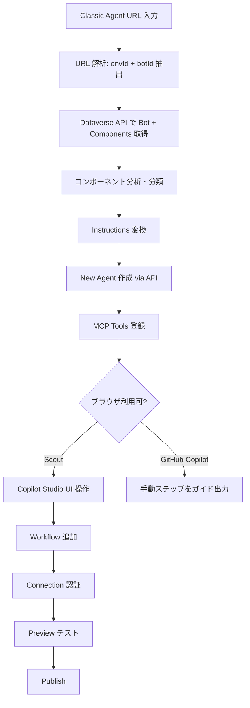
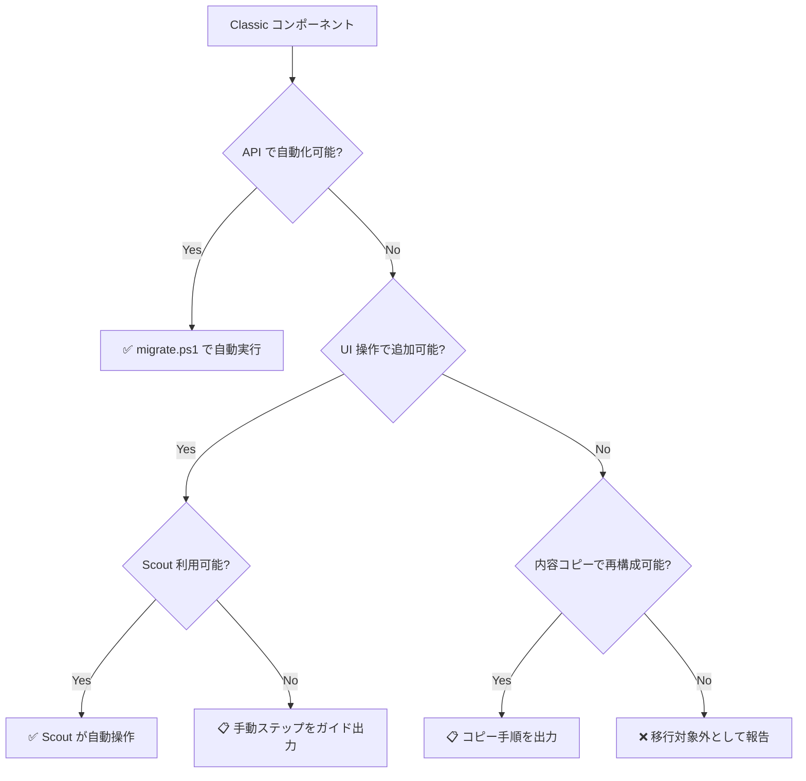

# Copilot Studio Migration Skill

> **English version**: [README.en.md](README.en.md)

Microsoft Copilot Studio の **Classic エージェント**を **New Experience エージェント**に移行する GitHub Copilot / Microsoft Scout 用スキルです。

## 概要

Copilot Studio の Classic エージェントは、Generative AI オーケストレーション、Instructions、Topics、Knowledge、MCP、Power Automate 連携、Adaptive Card など豊富な機能を備えた本格的なエージェント構築プラットフォームです。

2026年6月にリリースされた **New Experience** は、この Classic をさらに進化させたもので、主な違いは以下の通りです：

- **Topics の廃止**: Classic では Topics（トリガー + ノードベースの会話フロー）と Instructions を併用できたが、New では Topics が完全に廃止され、すべて Instructions + Tools/Skills で制御
- **オーケストレーション刷新**: Classic の Generative AI Recognizer から、Enhanced Orchestration Runtime（CLICopilotRecognizer）に変更。より深い推論能力
- **統合 UI**: Classic の Topics/Knowledge/Actions/Settings の分離ナビゲーションから、Build/Preview/Evaluate/Monitor のタブベース UI に統合
- **Skills**: 再利用可能な Markdown ベースの Skill パッケージが新規追加

公式には Classic → New の移行パスは提供されていません。このスキルは、Classic エージェントの URL を入力するだけで、New Experience エージェントを自動作成します。

## 機能

| 機能 | GitHub Copilot | Microsoft Scout |
|------|:-:|:-:|
| Classic エージェントの構成解析 | ✅ | ✅ |
| Instructions 自動変換 | ✅ | ✅ |
| New エージェント作成 | ✅ | ✅ |
| MCP Tools 登録 | ✅ | ✅ |
| Workflow (Power Automate) 追加 | ❌ 手動ガイド | ✅ ブラウザ自動操作 |
| Connection 認証 | ❌ 手動ガイド | ✅ ブラウザ自動操作 |
| テスト実行 | ❌ | ✅ Preview タブで自動テスト |
| Publish | ❌ 手動ガイド | ✅ ユーザー承認後に自動実行 |

## Classic → New 変換ルール

| Classic の要素 | New での対応 | 備考 |
|---|---|---|
| Instructions (GPT Config) | `agentSettings.instructions` | ほぼそのまま移行 |
| Topics (トリガー + ノード) | Instructions に統合 | Classic でも Instructions 併用可だったが、New では Topics 自体が廃止 |
| Knowledge Source (Dataverse) | Dataverse MCP Tool + Instructions にテーブル詳細 | アクセス方式が変わる |
| MCP Server アクション | McpTool コンポーネント | フォーマット変換のみ |
| Power Automate フロー | Workflow Tool（UI で追加） | Flow 自体は再利用 |
| Connector アクション | Tool（UI で追加） | Connection 再設定が必要 |
| Adaptive Card フォーム | 対話型ヒアリング（LLMが質問） | ビジュアル UX は変わる |
| Adaptive Card ボタン (messageBack) | テキストトリガー | ワンタップ → テキスト入力 |
| System Topics | 不要（Enhanced Orchestrator が自動処理） | Greeting 等の内容は Instructions に含める |
| Generative AI Recognizer | CLICopilotRecognizer (Enhanced) | 自動変換 |

## 前提条件

- **Azure CLI** (`az`) がインストール済みで、対象環境のテナントにログイン済み
- **PowerShell 7** (`pwsh`) がインストール済み
- 対象 Dataverse 環境の **Maker 権限**
- (Scout の場合) Copilot Studio にブラウザでサインイン済み

## インストール

### GitHub Copilot (VS Code)

フォルダごと `~/.copilot/skills/` に配置：

```
~/.copilot/skills/copilot-studio-migration/
├── SKILL.md
└── migrate.ps1
```

### Microsoft Scout

1. Scout の設定 → **Import Skill**
2. 「Drop a skill folder here」でこのリポジトリのフォルダを選択
3. または SKILL.md の raw URL を貼り付け:
   ```
   https://raw.githubusercontent.com/{owner}/copilot-studio-migration-skill/main/SKILL.md
   ```

## 使い方

### GitHub Copilot / Scout 共通

チャットで以下のように依頼：

```
この classic agent を new experience に移行して:
https://copilotstudio.preview.microsoft.com/environments/{envId}/bots/{botId}
```

### 初回実行時の準備

対象環境の Dataverse URL を確認：
```powershell
pac env list | Select-String "{envId}"
```

Azure CLI で対象テナントにログイン：
```powershell
az login --tenant {tenantId}
```

## 実行フロー



## ファイル構成

| ファイル | 説明 |
|----------|------|
| `SKILL.md` | スキル定義ファイル（トリガー条件、実行手順、変換ルール） |
| `migrate.ps1` | PowerShell 移行スクリプト（Phase 1: API ベース移行を実行） |
| `README.md` | このファイル |

## コンポーネント対応状況（全網羅）

Copilot Studio Classic の全コンポーネント/機能に対する移行対応状況です。

### ✅ API で自動移行

| コンポーネント | 移行方法 |
|---|---|
| Instructions / GPT Config | `agentSettings.instructions` に変換 |
| Custom Topics（トリガー + ノード） | Instructions 内に自然言語で記述 |
| System Topics（Greeting, Fallback 等） | 不要（New のオーケストレーターが自動処理） |
| MCP Server アクション | `McpTool` コンポーネントとして登録 |
| Knowledge Source（Dataverse テーブル） | Dataverse MCP Tool で代替 + Instructions にテーブル名・列・用途を明示記載 |
| Conversation Starters | Instructions に含める |
| Model 選択 | `agentSettings.model.series` に設定 |
| エスカレーション設定 | Instructions 内にフロー記述 |

### ⚠️ Scout UI 操作で移行可能（API 不可、ブラウザ操作で対応）

| コンポーネント | Scout での移行方法 | GH Copilot の場合 |
|---|---|---|
| Power Automate フロー | "Add a tool" → "Workflow" で追加 | 手動で同じ操作 |
| Connector アクション | "Add a tool" で Connector 追加 | 手動で同じ操作 |
| Connected Agents（子エージェント） | "Connected agents" で追加 | 手動で同じ操作 |
| Knowledge Source（SharePoint） | Knowledge セクションで URL 追加 | 手動で同じ操作 |
| Knowledge Source（URL/ファイル） | Knowledge セクションで追加 | 手動で同じ操作 |
| Knowledge Source（Bing Custom Search） | Knowledge セクションで Config ID 追加 | 手動で同じ操作 |
| Code Interpreter | Build 画面で有効化トグル | 手動で同じ操作 |
| Connection 認証 | OAuth フロー実行（Sign in クリック） | 手動で同じ操作 |
| チャネル追加（Web, M365 Copilot 等） | Publish → チャネル設定 | 手動で同じ操作 |
| 多言語設定 | Settings から言語追加 | 手動で同じ操作 |

### ⚠️ 手動コピー＋再設定で移行可能（内容は引き継げるが再構成が必要）

| コンポーネント | 移行方法 | 注意点 |
|---|---|---|
| AI Builder プロンプト（Topic 内ノード） | プロンプトテキストをコピー → Instructions または Skill に記述 | モデル選択・入出力設定は手動再構成。ツールとして追加する形式は New Experience で未提供（2026年7月時点） |
| Adaptive Card（入力フォーム） | 対話型フローに変換（自動）。元カードを保持したい場合は手動で Tool 化 | ビジュアル UX は変わる |
| Adaptive Card（ボタン/messageBack） | テキストトリガーに変換（自動） | ワンタップ → テキスト入力に変化 |
| 認証設定 (Authentication) | 認証モードは自動設定。OAuth 詳細は手動確認 | Client ID 等の再設定が必要な場合あり |
| 複雑な条件分岐（ConditionGroup） | Instructions に自然言語で記述。精度要件が高い場合は Skill 化 | LLM 依存のため決定論的ではない |
| Power Fx 式 | Workflow 内または Tool のロジックとして再実装 | そのままの移行は不可 |
| エンティティ（カスタム/プリビルト） | Instructions に抽出ルールを記述。LLM が自動抽出 | 正規表現ベースの厳密な抽出は不可 |
| 変数（Topic/Global/System） | Tool の入出力パラメータで代替 | 状態管理は Memory 機能で対応可能 |

### ❌ New Experience に存在しない / 移行対象外

| コンポーネント | 理由 |
|---|---|
| **Computer Use (CUA)** | Classic（generative orchestration ON）でのみ利用可能。New Experience では未提供（2026年7月時点）。Tool 設定（Instructions, Machine, Credentials）はエージェント定義に埋め込まれないため、移行対象外 |
| **Fabric / Foundry Data Agent (A2A)** | New Experience での A2A プロトコル経由の Fabric/Foundry 呼び出しは現時点で未確認。Connected Agents UI に表示されない可能性 |
| **AI Builder プロンプト（ツールとして追加）** | Classic の「Add a tool」→「Prompt」で追加される AI Builder プロンプトツールは、New Experience では未提供（2026年7月時点）。Topic 内ノード (`InvokeAIBuilderModelAction`) は Instructions への変換で対応可能 |
| **Component Collections** | エクスポート/インポート用パッケージ機能。移行ツールの対象外 |
| **Classic 固有の Analytics 設定** | New Experience は Monitor タブで自動提供。個別設定の引き継ぎ不要 |
| **Suggested Actions（クイック返信）** | New Experience で未サポート（2026年7月時点） |
| **Voice 設定（詳細チューニング）** | 音声感度・沈黙検出等の詳細設定は手動再構成。基本的な Voice チャネル追加は UI 操作で可能 |

### 移行判断フローチャート



## 制限事項

- **Fabric / Foundry A2A**: New Experience の Connected Agents UI に Fabric Data Agent 等が表示されるか未確認。表示されない場合は移行不可
- **Suggested Actions**: New Experience でクイック返信ボタンは未サポート（2026年7月時点）
- **Adaptive Card の完全再現**: ビジュアルレイアウトは対話型に変換される。元のカード体験を維持したい場合は別途設計が必要
- **PAC CLI バグ**: `pac copilot extract-template` は新しい Knowledge Source タイプで crash する既知の問題あり（本スキルは直接 API を使用して回避）
- **決定論的フロー制御**: Classic の ConditionGroup による厳密な分岐は LLM 依存になるため、100% の再現性は保証できない

## トラブルシューティング

| エラー | 原因 | 対処 |
|--------|------|------|
| `az account get-access-token` 失敗 | 未ログイン or テナント違い | `az login --tenant {tenantId}` |
| Bot 作成で 403 | Maker 権限不足 | 環境の Maker ロールを確認 |
| Component 作成で 400 | schemaname 問題 | ASCII 文字のみ、100文字以内 |
| Script encoding error | Windows PowerShell (5.1) | `pwsh` (PowerShell 7) を使用 |

## ライセンス

MIT
